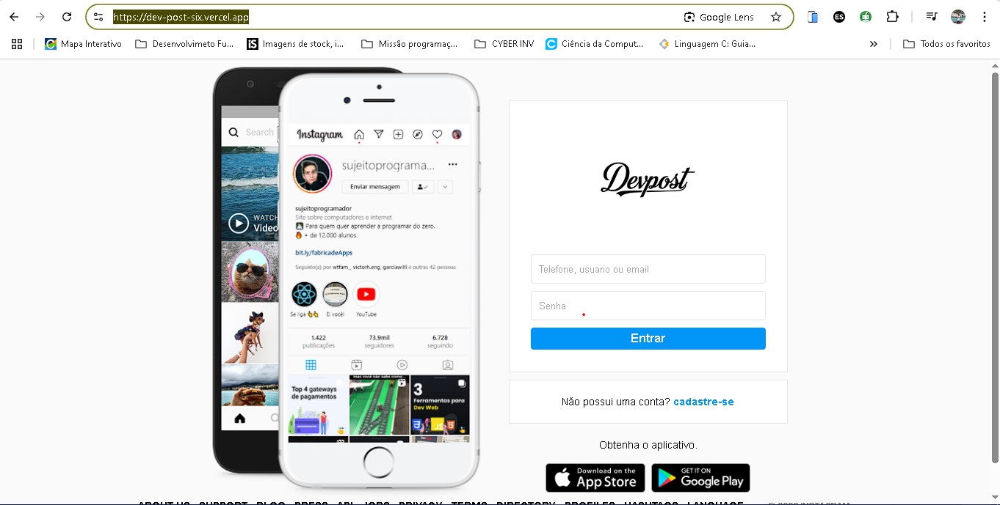

# 📸 Devpos - Clone do Instagram

Devpos é um clone visual do Instagram desenvolvido com **HTML5** e **CSS3**. O projeto tem como objetivo praticar e demonstrar habilidades em estruturação de páginas, estilização moderna e layout responsivo — tudo feito sem o uso de frameworks.

 <!-- Substitua com o caminho da imagem do projeto ou link de deploy -->

## 🚀 Tecnologias Utilizadas

- HTML5 semântico
- CSS3 puro
- Flexbox
- CSS Grid
- Responsividade (mobile-first)

## 🎯 Objetivo

Este projeto foi criado para treinar a construção de interfaces inspiradas em plataformas populares, reforçando os fundamentos do front-end e boas práticas de código limpo e organizado.

## 📱 Preview

Você pode acessar o projeto online aqui:  
👉 [Link do Projeto Publicado](https://dev-post-six.vercel.app/)

Ou clonar e rodar localmente:

```bash
git clone https://github.com/seuusuario/devpos.git
cd devpos
abra o arquivo index.html no seu navegador
```
